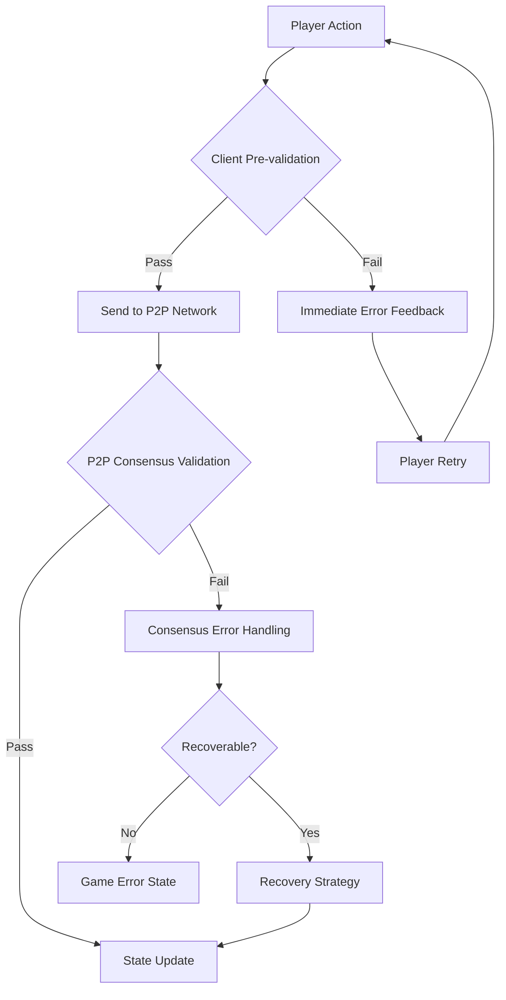

# Validation & Error Handling Specification

## Overview

**Title**: Validation & Error Handling

**Type**: Component

**Status**: Draft

**Priority**: High

**Estimated Effort**: Medium

**Date Created**: 2026-01-20

**Last Updated**: 2026-01-20

### Description
Define the comprehensive validation pipeline and error handling system for player actions and game states in the Web Uno application. This component ensures game integrity through client-side pre-validation, P2P majority consensus validation, cheating prevention measures, and robust network issue handling.

### Goals
- Ensure all player actions are validated against game rules and current state
- Prevent cheating through comprehensive security measures and trust boundaries
- Handle network issues gracefully with automatic recovery mechanisms
- Provide clear, actionable error feedback to users
- Maintain game state consistency across all players

### Dependencies
- Active Game Session (specs/features/active-game-session.md) - Primary consumer of validation logic
- P2P Multiplayer System (specs/features/p2p-multiplayer-system.md) - Consensus validation mechanism
- Game State Types (specs/types/game-state-types.md) - Data structures for validation
- Uno Logic Rules (specs/game/uno-logic-rules.md) - Business rule validation
- Coding Standards (specs/coding-standards.md) - Implementation guidelines

## Requirements

### Functional Requirements
- [FR-001] Implement client-side pre-validation for immediate user feedback
- [FR-002] Provide P2P majority consensus validation for security
- [FR-003] Validate all player actions against current game state and rules
- [FR-004] Prevent cheating through action tampering detection and state manipulation prevention
- [FR-005] Handle network disconnections during validation with recovery mechanisms
- [FR-006] Resolve race conditions from simultaneous actions
- [FR-007] Detect and prevent timing-based attacks
- [FR-008] Maintain game state consistency across network disruptions
- [FR-009] Provide standardized error codes and user-friendly messages
- [FR-010] Log validation failures for debugging and security monitoring

### Non-Functional Requirements
- [NFR-001] Validation response time < 100ms for user actions
- [NFR-002] Zero-tolerance for cheating exploits in validated scenarios
- [NFR-003] Automatic recovery from 95% of network validation failures
- [NFR-004] Error messages localized and accessible (WCAG 2.1 AA)
- [NFR-005] Validation logic testable in isolation
- [NFR-006] Memory-efficient error state management

### User Stories
- As a player, I want invalid moves prevented so that I don't accidentally break the game
- As a legitimate player, I want cheating attempts blocked so that the game remains fair
- As a player experiencing connection issues, I want the game to handle disruptions gracefully so that I can continue playing
- As a developer, I want detailed error logging so that I can debug and improve the system

## Technical Specification

### API Interface
```typescript
// Validation result types
interface ValidationResult {
  isValid: boolean
  error?: ValidationError
  warnings?: string[]
}

// Error classification
interface ValidationError {
  code: ValidationErrorCode
  message: string
  severity: 'warning' | 'error' | 'critical'
  context: Record<string, any>
  recoverable: boolean
}

// Validation pipeline interface
interface ValidationPipeline {
  validateAction(action: GameAction, gameState: ActiveGameState, playerId: string): Promise<ValidationResult>
  validateStateTransition(fromState: ActiveGameState, toState: ActiveGameState): Promise<ValidationResult>
  recoverFromValidationError(error: ValidationError, gameState: ActiveGameState): Promise<ActiveGameState | null>
}

// Consensus result for majority validation
interface ConsensusResult {
  majorityResult: ValidationResult
  participantCount: number
  consensusReached: boolean
  isTie: boolean
  executionTime: number
  warningTriggered?: boolean
}

// Cheating detection interface
interface CheatDetection {
  detectTampering(action: GameAction, playerHistory: GameAction[]): Promise<CheatResult>
  detectTimingAttack(actions: GameAction[], timestamps: number[]): Promise<CheatResult>
  validateClientTrust(clientId: string, action: GameAction): Promise<TrustResult>
}
```

### Validation Pipeline Architecture

```typescript
// Core validation pipeline
class GameValidationPipeline implements ValidationPipeline {
  async validateAction(action: GameAction, gameState: ActiveGameState, playerId: string): Promise<ValidationResult> {
    // 1. Client trust validation
    const trustResult = await this.cheatDetection.validateClientTrust(playerId, action)
    if (!trustResult.trusted) {
      return this.createErrorResult('CHEATING_DETECTED', trustResult.reason)
    }

    // 2. Timing attack detection
    const timingResult = await this.cheatDetection.detectTimingAttack([action], [Date.now()])
    if (timingResult.detected) {
      return this.createErrorResult('TIMING_ATTACK', timingResult.details)
    }

    // 3. Business rule validation
    const ruleResult = await this.validateAgainstRules(action, gameState)
    if (!ruleResult.isValid) {
      return ruleResult
    }

    // 4. State consistency validation
    const stateResult = await this.validateStateTransition(gameState, this.simulateAction(gameState, action))
    if (!stateResult.isValid) {
      return stateResult
    }

    // 5. P2P majority consensus validation
    const consensusResult = await this.p2pConsensus.validateAction(action, gameState)

    // Handle consensus failures
    if (!consensusResult.consensusReached) {
      if (consensusResult.isTie) {
        // Allow action but warn players of potential cheating
        await this.broadcastCheatingWarning(gameState)
        return consensusResult.majorityResult // Allow with warning
      }
      // Timeout or other failure - reject
      return this.createErrorResult('CONSENSUS_TIMEOUT', 'Validation consensus could not be reached')
    }

    return consensusResult.majorityResult
  }

  async recoverFromValidationError(error: ValidationError, gameState: ActiveGameState): Promise<ActiveGameState | null> {
    switch (error.code) {
      case 'NETWORK_DISCONNECT':
        return await this.handleDisconnectRecovery(gameState)
      case 'RACE_CONDITION':
        return await this.resolveRaceCondition(gameState)
      case 'STATE_CONFLICT':
        return await this.p2pConsensus.resolveStateConflict(gameState)
      case 'CONSENSUS_TIMEOUT':
      case 'CONSENSUS_TIE':
        // Allow action with warning for consensus issues
        await this.broadcastCheatingWarning(gameState)
        return gameState // Continue with action
      default:
        return null // Non-recoverable
    }
  }
}
```

### Error Handling & Recovery

```typescript
// Error codes and handling
enum ValidationErrorCode {
  // Business logic errors
  INVALID_MOVE = 'INVALID_MOVE',
  NOT_YOUR_TURN = 'NOT_YOUR_TURN',
  CARD_NOT_IN_HAND = 'CARD_NOT_IN_HAND',
  RULE_VIOLATION = 'RULE_VIOLATION',

  // Security errors
  CHEATING_DETECTED = 'CHEATING_DETECTED',
  TIMING_ATTACK = 'TIMING_ATTACK',
  CLIENT_NOT_TRUSTED = 'CLIENT_NOT_TRUSTED',

  // Network errors
  NETWORK_DISCONNECT = 'NETWORK_DISCONNECT',
  RACE_CONDITION = 'RACE_CONDITION',
  STATE_CONFLICT = 'STATE_CONFLICT',
  CONSENSUS_FAILURE = 'CONSENSUS_FAILURE',
  CONSENSUS_TIMEOUT = 'CONSENSUS_TIMEOUT',
  CONSENSUS_TIE = 'CONSENSUS_TIE'
}

// Recovery strategies
interface RecoveryStrategy {
  canRecover(error: ValidationError): boolean
  executeRecovery(gameState: ActiveGameState, error: ValidationError): Promise<ActiveGameState>
}

// Majority consensus validator
class MajorityConsensusValidator {
  private consensusTimeout = 3000 // 3 seconds

  async validateAction(action: GameAction, gameState: ActiveGameState): Promise<ConsensusResult> {
    const connectedPeers = this.getConnectedPeers(gameState)
    const startTime = Date.now()

    if (connectedPeers.length === 0) {
      // Single player or no peers - allow with warning
      return {
        majorityResult: { isValid: true },
        participantCount: 1,
        consensusReached: true,
        isTie: false,
        executionTime: 0,
        warningTriggered: true
      }
    }

    // Broadcast validation request to peers (no user feedback required)
    const validationPromises = connectedPeers.map(peer =>
      this.requestPeerValidation(peer, action, gameState)
    )

    try {
      // Wait for all responses with timeout
      const results = await Promise.race([
        Promise.all(validationPromises),
        this.timeoutPromise(this.consensusTimeout)
      ]) as ValidationResult[]

      // Determine majority
      const validCount = results.filter(r => r.isValid).length
      const invalidCount = results.length - validCount
      const majorityValid = validCount > invalidCount
      const isTie = validCount === invalidCount

      return {
        majorityResult: majorityValid ? { isValid: true } : { isValid: false, error: results.find(r => !r.isValid)?.error },
        participantCount: results.length,
        consensusReached: !isTie,
        isTie,
        executionTime: Date.now() - startTime,
        warningTriggered: isTie
      }
    } catch (error) {
      // Timeout or network error
      return {
        majorityResult: { isValid: false, error: { code: ValidationErrorCode.CONSENSUS_TIMEOUT, message: 'Consensus timeout' } },
        participantCount: connectedPeers.length,
        consensusReached: false,
        isTie: false,
        executionTime: Date.now() - startTime
      }
    }
  }

  private getConnectedPeers(gameState: ActiveGameState): string[] {
    // Return IDs of connected players excluding the current player
    return gameState.players
      .filter(p => p.id !== gameState.currentPlayerId && p.isConnected)
      .map(p => p.id)
  }

  private async requestPeerValidation(peerId: string, action: GameAction, gameState: ActiveGameState): Promise<ValidationResult> {
    // Send validation request to peer via P2P
    // Return peer's validation result
  }

  private timeoutPromise(ms: number): Promise<never> {
    return new Promise((_, reject) => setTimeout(() => reject(new Error('Timeout')), ms))
  }

  private async broadcastCheatingWarning(gameState: ActiveGameState): Promise<void> {
    // Broadcast warning message to all connected players
    const warningMessage = "Warning: Validation consensus could not be reached. This may indicate cheating attempts."
    await this.p2pSystem.broadcastMessage('CHEATING_WARNING', warningMessage)
  }
}
```

### Cheating Prevention Measures

```typescript
// Client trust validation
class ClientTrustValidator {
  validateClientTrust(clientId: string, action: GameAction): Promise<TrustResult> {
    // 1. Verify client identity through P2P authentication
    // 2. Check action frequency patterns
    // 3. Validate action doesn't exceed reasonable bounds
    // 4. Cross-reference with known client behavior
  }

  detectTampering(action: GameAction, history: GameAction[]): Promise<CheatResult> {
    // 1. Cryptographic action signature verification
    // 2. Action sequence anomaly detection
    // 3. State manipulation attempt detection
    // 4. Pattern-based cheating identification
  }
}

// Timing attack prevention
class TimingAttackDetector {
  detectTimingAttack(actions: GameAction[], timestamps: number[]): Promise<CheatResult> {
    // 1. Analyze action timing patterns
    // 2. Detect automated/scripted behavior
    // 3. Identify timing-based exploits
    // 4. Rate limiting for rapid actions
  }
}
```

### Network Issue Handling

```typescript
// Network-aware validation
class NetworkResilientValidator {
  async validateWithNetworkResilience(action: GameAction, gameState: ActiveGameState): Promise<ValidationResult> {
    try {
      // Primary validation attempt
      const result = await this.attemptValidation(action, gameState)

      if (result.isValid) {
        return result
      }

      // Network-specific error handling
      if (this.isNetworkError(result.error)) {
        return await this.handleNetworkValidationError(result.error, gameState)
      }

      return result
    } catch (networkError) {
      // Fallback validation for offline scenarios
      return await this.offlineValidationFallback(action, gameState)
    }
  }

  async handleDisconnectRecovery(gameState: ActiveGameState): Promise<ActiveGameState> {
    // 1. Remove disconnected players from consensus
    // 2. Continue validation with remaining connected players
    // 3. Update participant counts automatically
    // 4. When player reconnects, include them in future consensus
    // 5. No action buffering - disconnected players miss actions
  }

  async resolveRaceCondition(gameState: ActiveGameState): Promise<ActiveGameState> {
    // 1. Identify conflicting actions
    // 2. Apply deterministic resolution rules
    // 3. Notify affected players
    // 4. Update game state consistently
  }
}
```

### Data Structures
```typescript
// Validation context
interface ValidationContext {
  playerId: string
  gameId: string
  actionHistory: GameAction[]
  networkState: NetworkState
  clientTrustScore: number
}

// Network state tracking
interface NetworkState {
  isConnected: boolean
  latency: number
  lastSyncTime: Date
  pendingActions: GameAction[]
}
```

## Implementation Notes

### Architecture Decisions
- Layered validation approach (client → P2P majority consensus)
- Immutable validation results for debugging
- Event-driven error recovery system
- Separation of business logic from security concerns

### Design Patterns
- Strategy pattern for different validation types
- Observer pattern for validation event monitoring
- Chain of responsibility for validation pipeline
- Circuit breaker for network failure handling

### Code Organization
- `src/components/validation/` - Core validation components
- `src/utils/validation/` - Validation utilities and helpers
- `src/hooks/useValidation.ts` - React hook for validation integration
- `src/types/validation.ts` - Validation-specific type definitions

### Testing Strategy
- Unit tests for individual validation rules
- Integration tests for full validation pipeline
- Security tests for cheating prevention measures
- Chaos engineering tests for network failure scenarios
- Performance tests for validation timing requirements

## Acceptance Criteria

### Validation Functionality
- [ ] All game actions pass/fail validation correctly
- [ ] Invalid moves are rejected with appropriate error messages
- [ ] Business rules are enforced consistently
- [ ] State transitions maintain game integrity

### Cheating Prevention
- [ ] Client trust validation blocks unauthorized actions
- [ ] Timing attacks are detected and prevented
- [ ] State manipulation attempts are blocked
- [ ] Tampering detection identifies suspicious patterns

### Network Resilience
- [ ] Disconnections during validation trigger recovery mechanisms
- [ ] Race conditions are resolved deterministically
- [ ] State conflicts are automatically resolved
- [ ] Network failures don't corrupt game state

### Error Handling
- [ ] Error messages are user-friendly and actionable
- [ ] Critical errors trigger appropriate recovery flows
- [ ] Validation failures are logged for debugging
- [ ] Recovery mechanisms restore game functionality

### Performance
- [ ] Validation completes within 100ms for all scenarios
- [ ] Network recovery doesn't exceed 5 seconds
- [ ] Memory usage remains stable during validation failures
- [ ] CPU overhead is minimal for continuous validation

### Security
- [ ] Zero successful cheating attempts in tested scenarios
- [ ] Client-side validation doesn't expose server logic
- [ ] Error messages don't leak sensitive information
- [ ] Validation pipeline is resistant to bypass attempts

## Diagrams



## References

- [Active Game Session Spec](specs/features/active-game-session.md)
- [P2P Multiplayer System](specs/features/p2p-multiplayer-system.md)
- [Game State Types](specs/types/game-state-types.md)
- [Uno Logic Rules](specs/game/uno-logic-rules.md)
- [Coding Standards](specs/coding-standards.md)
- [WebRTC Security Best Practices](https://w3c.github.io/webrtc-security/)
- [Game Cheat Prevention Patterns](https://gamedev.stackexchange.com/questions/19072/preventing-cheating-in-online-games)
- [Distributed Consensus Algorithms](https://en.wikipedia.org/wiki/Consensus_(computer_science))

---

*Spec Version: 1.0 | Status: Draft | Ready for Implementation*</content>
<parameter name="filePath">specs/components/validation-error-handling.md