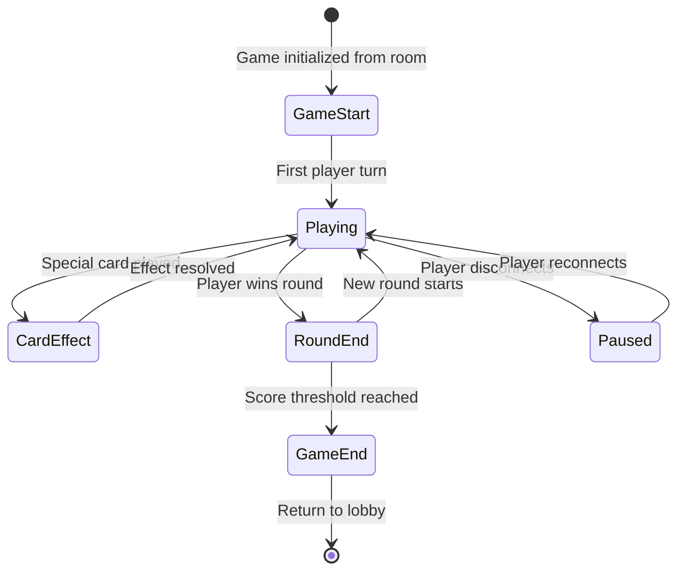

# Active Game Session Specification

## Overview

**Title**: Active Game Session

**Type**: Feature

**Status**: Draft

**Priority**: High

**Estimated Effort**: Large

**Date Created**: 2026-01-20

**Last Updated**: 2026-01-20

### Description
The active game session represents the core gameplay experience after a game has started in the game room. It manages turn-based Uno gameplay, including card playing, special card effects, win conditions, round progression, and real-time synchronization across all players.

### Goals
- Provide smooth, real-time multiplayer Uno gameplay
- Ensure fair turn-based mechanics with proper rule enforcement
- Maintain game state consistency across network participants
- Deliver an engaging and responsive user experience
- Handle all game phases from start to completion

### Dependencies
- Game Room (specs/features/game-room.md) - Navigation source and game initialization
- P2P Multiplayer System (specs/features/p2p-multiplayer-system.md) - Real-time synchronization and state management
- Game State Types (specs/types/game-state-types.md) - Data structures for active gameplay
- Uno Logic Rules (specs/game/uno-logic-rules.md) - Game mechanics and validation
- Component Library (specs/components/ui-components.md) - Game Board, Player Hand, Game Actions components

## Requirements

### Functional Requirements
- [FR-001] Display the active game board with current card and discard pile
- [FR-002] Show each player's hand with appropriate visibility (own hand fully visible, others hidden)
- [FR-003] Manage turn-based gameplay with automatic turn progression
- [FR-004] Validate card plays according to Uno rules before execution
- [FR-005] Handle special card effects (skip, reverse, draw cards, wild cards)
- [FR-006] Support player actions: draw card, play card, call Uno
- [FR-007] Detect win conditions and end rounds automatically
- [FR-008] Manage round transitions and accumulate scores
- [FR-009] Display current game status (active player, direction, round number)
- [FR-010] Handle game completion and final scoring
- [FR-011] Provide real-time synchronization of all game actions via P2P
- [FR-012] Support player disconnection handling during active play
- [FR-013] Enable game pause/resume for network issues
- [FR-014] Validate all moves and prevent invalid actions

### Non-Functional Requirements
- [NFR-001] Turn transitions complete within 500ms
- [NFR-002] Real-time updates synchronized within 1 second across all players
- [NFR-003] Support simultaneous gameplay for 2-10 players
- [NFR-004] Maintain game state consistency during network disruptions
- [NFR-005] Provide accessible controls and feedback for all players
- [NFR-006] Handle high-frequency actions without performance degradation
- [NFR-007] Support responsive design for mobile and desktop play

### User Stories
- As a player, I want to see the game board and my cards clearly so that I can make informed decisions
- As the current player, I want intuitive controls to draw or play cards so that I can act quickly
- As a player, I want to see special card effects happen immediately so that I understand game state changes
- As a player, I want the game to prevent invalid moves so that I don't make mistakes
- As a player, I want to see whose turn it is and game progress so that I stay engaged
- As a player, I want the game to handle disconnections gracefully so that I can resume playing
- As a winner, I want to see final scores and game completion so that I can celebrate my victory

## Technical Specification

### API Interface
```typescript
// Game session page props
interface GameSessionPageProps {
  gameId: string
  initialGameState: UnoGameState
  playerId: string
  onGameEnd: (finalScores: PlayerScore[]) => void
  onPlayerLeave: () => void
}

// Game action types
interface GameActions {
  playCard: (cardId: string, playerId: string) => Promise<GameActionResult>
  drawCard: (playerId: string) => Promise<GameActionResult>
  callUno: (playerId: string) => Promise<GameActionResult>
}

// Game state structure for active play
interface ActiveGameState extends UnoGameState {
  currentPlayerId: string
  direction: 'clockwise' | 'counterclockwise'
  roundNumber: number
  roundScores: Record<string, number>
  gameStartTime: Date
  lastActionTime: Date
  isPaused: boolean
  pausedReason?: 'disconnection' | 'network_issue'
}

// Action result types
type GameActionResult =
  | { success: true; newState: ActiveGameState; effects: CardEffect[] }
  | { success: false; error: GameError; newState?: ActiveGameState }
```

### Data Structures
```typescript
// Extended from game state types
interface CardEffect {
  type: 'skip' | 'reverse' | 'draw' | 'wild_color_change'
  targetPlayerId?: string
  cardsToDraw?: number
  newColor?: CardColor
}

type GamePhase = 'playing' | 'card_effect' | 'round_end' | 'game_end'

interface GameError {
  code: 'invalid_move' | 'not_your_turn' | 'card_not_in_hand' | 'rule_violation'
  message: string
  playerId: string
}
```

### Component Structure
```typescript
// Main game session page component
const GameSessionPage: React.FC<GameSessionPageProps> = ({ gameId, ...props }) => {
  // Manages active game state, P2P subscriptions, and UI rendering
}

// Game status component
interface GameStatusProps {
  gameState: ActiveGameState
  currentPlayer: Player
}

const GameStatus: React.FC<GameStatusProps> = ({ gameState, currentPlayer }) => {
  // Shows current player, direction, round, scores
}

// Turn indicator component
interface TurnIndicatorProps {
  currentPlayerId: string
  players: Player[]
  direction: 'clockwise' | 'counterclockwise'
}

const TurnIndicator: React.FC<TurnIndicatorProps> = ({ currentPlayerId, ...props }) => {
  // Visual indication of whose turn it is
}

// Game controls component
interface GameControlsProps {
  gameState: ActiveGameState
  playerId: string
  onAction: (action: GameAction) => void
  isCurrentPlayer: boolean
}

const GameControls: React.FC<GameControlsProps> = ({ gameState, ...props }) => {
  // Action buttons and controls for current player
}
```

### State Management
- P2P-synchronized game state for all players
- Local optimistic updates for responsive UI
- Conflict resolution for simultaneous actions
- Automatic state recovery on reconnection

### Error Handling
- Client-side move validation with immediate feedback
- P2P majority consensus validation
- Automatic retry for network-related failures
- Graceful degradation during connectivity issues

## Implementation Notes

### Architecture Decisions
- Game loop architecture with centralized state management
- Event-driven action processing with validation pipeline
- P2P-first approach with local state for responsiveness
- Immutable game state updates to prevent conflicts

### Design Patterns
- Command pattern for game actions
- Observer pattern for real-time updates
- Strategy pattern for different game phases
- Factory pattern for card effects

### Code Organization
- `src/app/game-session/[gameId]/page.tsx` - Main session page with routing
- `src/components/game/` - Game-specific components (status, controls, effects)
- `src/hooks/useGameSession.ts` - P2P game state management hook
- `src/utils/gameLogic/` - Action validation and effect processing
- `src/types/game-session.ts` - Session-specific type definitions

### Testing Strategy
- Unit tests for action validation and state transitions
- Integration tests for P2P synchronization
- E2E tests for complete game sessions with multiple players
- Load tests for performance with many simultaneous players
- Edge case tests for disconnections and conflicts

## Acceptance Criteria

### Functional Tests
- [ ] Game starts with correct initial state from game room
- [ ] Turn progression works correctly in both directions
- [ ] Card plays are validated and executed properly
- [ ] Special card effects trigger appropriate responses
- [ ] Win conditions are detected and rounds end
- [ ] Scores accumulate correctly across rounds
- [ ] Game ends with proper final scoring
- [ ] Player disconnections pause game appropriately
- [ ] Reconnection restores game state correctly

### Game Flow Tests
- [ ] Complete game from start to finish with 2 players
- [ ] Complete game from start to finish with 4+ players
- [ ] All special card types function correctly
- [ ] Invalid moves are prevented and feedback provided
- [ ] Network interruptions handled gracefully
- [ ] Game state remains consistent across all players

### Performance Criteria
- [ ] Turn transitions <500ms end-to-end
- [ ] Real-time updates <1 second latency
- [ ] Support 10 players without performance degradation
- [ ] Memory usage stable during long games
- [ ] Network traffic optimized for real-time play

### Security Requirements
- [ ] All actions validated via P2P majority consensus
- [ ] No cheating through client-side manipulation
- [ ] Game state tamper-proof
- [ ] Player authentication maintained throughout session

## Diagrams



## References

- [Game Room Spec](specs/features/game-room.md)
- [P2P Multiplayer System](specs/features/p2p-multiplayer-system.md)
- [Game State Types](specs/types/game-state-types.md)
- [Uno Logic Rules](specs/game/uno-logic-rules.md)
- [UI Components Overview](specs/components/ui-components.md)
- [Uno Game Rules](https://en.wikipedia.org/wiki/Uno_(card_game))
- [Real-time Game Architecture](https://docs.yjs.dev/)
- [Multiplayer Game Development Patterns](https://gamedev.stackexchange.com/questions/299/multiplayer-turn-based-game-how-to-cheat-prevention)

---

*Spec Version: 1.0 | Status: Draft | Ready for Implementation*</content>
<parameter name="filePath">specs/features/active-game-session.md