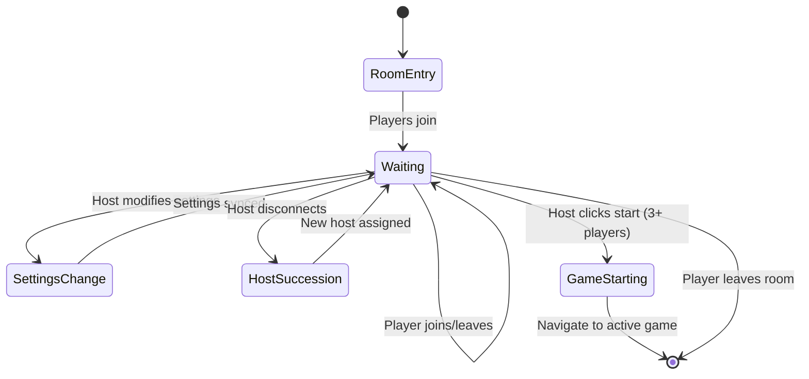

# Game Room Specification

## Overview

**Title**: Game Room

**Type**: Feature

**Status**: Draft

**Priority**: High

**Estimated Effort**: Medium

**Date Created**: 2026-01-20

**Last Updated**: 2026-01-20

### Description
The game room is the waiting area where players who have joined a room gather before starting the Uno game. It displays an empty/placeholder game board, a real-time list of connected players, configurable game settings controlled by the host, and provides options for players to leave or for the host to start the game when ready. Disconnected players are automatically removed from the room to maintain an active waiting environment.

### Goals
- Create an engaging waiting experience for players before gameplay
- Enable host-controlled game configuration and start controls
- Ensure real-time collaboration and smooth room management
- Provide clear transitions to active gameplay
- Maintain room continuity through host succession and player management

### Dependencies
- Lobby (specs/features/lobby.md) - Navigation source to game room
- P2P Multiplayer System (specs/features/p2p-multiplayer-system.md) - Real-time synchronization and room state management
- Game State Types (specs/types/game-state-types.md) - Player and room data structures
- Uno Game Logic and Rules (specs/game/uno-logic-rules.md) - Game initialization with configured settings
- Player List (specs/components/player-list.md) - Component for displaying room players

## Requirements

### Functional Requirements
- [FR-001] Display an empty/placeholder Uno game board layout during waiting
- [FR-002] Show a real-time list of connected players with join order and host indicator
- [FR-003] Allow the host to configure game settings: time limits (turn time, game duration) and special Uno rules (stacking +2/+4, draw 4 challenges)
- [FR-004] Provide a "Start Game" button for the host, enabled only when minimum 3 players are present
- [FR-005] Provide a "Leave Room" button for all players to exit back to lobby
- [FR-006] Implement automatic host succession: transfer host role to earliest-joined player on host disconnect
- [FR-007] Automatically remove disconnected players from the room immediately
- [FR-008] Display room information (room ID, current player count, host name)
- [FR-009] Navigate to active game upon successful start
- [FR-010] Prevent game start if fewer than 3 players are connected

### Non-Functional Requirements
- [NFR-001] Real-time updates via P2P synchronization (<1 second latency)
- [NFR-002] Responsive design supporting mobile and desktop
- [NFR-003] Accessibility compliant (WCAG 2.1 AA) with keyboard navigation
- [NFR-004] Secure room access (only joined players can view/interact)
- [NFR-005] Smooth transitions between room states and navigation

### User Stories
- As a player, I want to see the game board layout while waiting so that I can preview the game setup
- As a player, I want to see who's in the room and who the host is so that I can coordinate with others
- As the host, I want to configure time limits and special rules so that I can customize the game experience
- As the host, I want to start the game only when at least 3 players are ready so that the game is balanced
- As a player, I want to leave the room easily if I change my mind so that I can return to the lobby
- As a player, I want the room to continue if someone disconnects so that we can still play with remaining players
- As a player, I want a new host assigned automatically if the current host leaves so that the room stays organized

## Technical Specification

### API Interface
```typescript
// Game room page props
interface GameRoomPageProps {
  roomId: string
  initialPlayerName: string
  onLeaveRoom: () => void
  onStartGame: (settings: GameSettings) => void
}

// Room state structure
interface RoomState {
  id: string
  hostId: string
  players: Player[]
  settings: GameSettings
  isGameStarting: boolean
}

// Player information
interface Player {
  id: string
  name: string
  joinedAt: Date
  isHost: boolean
  isConnected: boolean
}

// Game settings configured by host
interface GameSettings {
  timeLimits: {
    turnTimeSeconds: number | null  // null = no limit
    gameDurationMinutes: number | null  // null = no limit
  }
  specialRules: {
    allowStacking: boolean  // stack +2/+4 cards
    enableDraw4Challenge: boolean  // challenge invalid draw 4
  }
}

// P2P events for room synchronization
interface RoomEvents {
  playerJoined: (player: Player) => void
  playerLeft: (player: Player) => void
  hostChanged: (newHostId: string) => void
  settingsUpdated: (settings: GameSettings) => void
  gameStarting: () => void
}
```

### Data Structures
```typescript
// Extended room data for P2P sync
interface SyncedRoomData {
  roomState: RoomState
  lastUpdated: Date
  version: number  // For conflict resolution
}
```

### Component Structure
```typescript
// Main game room page component
const GameRoomPage: React.FC<GameRoomPageProps> = ({ roomId, ...props }) => {
  // Manages room state, P2P subscriptions, and UI rendering
}

// Room header component
interface RoomHeaderProps {
  roomId: string
  hostName: string
  playerCount: number
}

const RoomHeader: React.FC<RoomHeaderProps> = ({ roomId, ...props }) => {
  // Displays room info and branding
}

// Player list component
interface PlayerListProps {
  players: Player[]
  currentPlayerId: string
}

const PlayerList: React.FC<PlayerListProps> = ({ players, ...props }) => {
  // Shows connected players with host indicator
}

// Settings panel for host
interface GameSettingsPanelProps {
  settings: GameSettings
  isHost: boolean
  onSettingsChange: (settings: GameSettings) => void
}

const GameSettingsPanel: React.FC<GameSettingsPanelProps> = ({ settings, ...props }) => {
  // Host-only settings configuration UI
}

// Empty game board display
interface PlaceholderGameBoardProps {
  playerCount: number
}

const PlaceholderGameBoard: React.FC<PlaceholderGameBoardProps> = ({ playerCount }) => {
  // Shows empty Uno board layout
}
```

### State Management
- Local component state for UI interactions and pending changes
- P2P-synchronized room state for real-time player list and settings
- Host succession logic handled via P2P events
- Optimistic updates for settings changes with rollback on conflict

### Error Handling
- Connection loss: Attempt P2P reconnection, show offline state
- Host succession failures: Fallback to alphabetical player order
- Settings conflicts: Last-write-wins with notification
- Invalid room access: Redirect to lobby with error message

## Implementation Notes

### Architecture Decisions
- Page-level component using Next.js App Router with dynamic routing
- P2P-first approach for real-time features, with local state for responsiveness
- Host authority model with automatic succession to maintain order
- Settings as immutable during waiting (changes sync immediately)

### Design Patterns
- Observer pattern for P2P event subscriptions
- Strategy pattern for host succession algorithms
- Compound components for modular room UI sections

### Code Organization
- `src/app/game-room/[roomId]/page.tsx` - Main room page with routing
- `src/components/room/` - Room-specific components (header, player list, settings)
- `src/hooks/useRoomState.ts` - P2P room state management hook
- `src/utils/roomSettings.ts` - Settings validation and defaults
- `src/types/room.ts` - Room-related TypeScript interfaces

### Testing Strategy
- Unit tests for settings validation and host succession logic
- Integration tests for P2P room state synchronization
- E2E tests for complete room flow (join → configure → start game)
- Accessibility tests for screen reader support and keyboard navigation

## Acceptance Criteria

### Functional Tests
- [ ] Empty game board displays correctly on room entry
- [ ] Player list updates in real-time as players join/leave
- [ ] Host indicator shows correctly and transfers on disconnect
- [ ] Settings panel only visible/editable by host
- [ ] Start game button disabled with <3 players
- [ ] Leave room button navigates back to lobby
- [ ] Disconnected players removed from list immediately
- [ ] Game starts and navigates to active gameplay
- [ ] Settings apply to game initialization

### Edge Cases
- [ ] Host disconnects during settings change (succession occurs, changes preserved)
- [ ] All players disconnect except one (room dissolves, redirect to lobby)
- [ ] Network interruption during start (retry or cancel option)
- [ ] Multiple rapid joins/leaves (state remains consistent)
- [ ] Settings conflict resolution (last change wins)

### Performance Criteria
- [ ] Room state updates within 1 second of P2P events
- [ ] UI remains responsive with 10+ players in room
- [ ] Memory usage stable during long waiting periods
- [ ] Initial room load <3 seconds

### Security Requirements
- [ ] Room access restricted to joined players only
- [ ] Settings changes validated via P2P consensus (future auth)
- [ ] No XSS in player names or room data
- [ ] Host succession prevents unauthorized control

## Diagrams



## References

- [Lobby Spec](specs/features/lobby.md)
- [P2P Multiplayer System](specs/features/p2p-multiplayer-system.md)
- [Game State Types](specs/types/game-state-types.md)
- [Uno Logic Spec](specs/game/uno-logic-rules.md)
- [Player List Spec](specs/components/player-list.md)
- [Uno Game Rules](https://en.wikipedia.org/wiki/Uno_(card_game))
- [P2P Synchronization Patterns](https://docs.yjs.dev/)
- [React Real-time Hooks](https://react.dev/learn/you-might-not-need-an-effect)

---

*Spec Version: 1.0 | Status: Draft | Ready for Implementation*</content>
<parameter name="filePath">specs/features/game-room.md