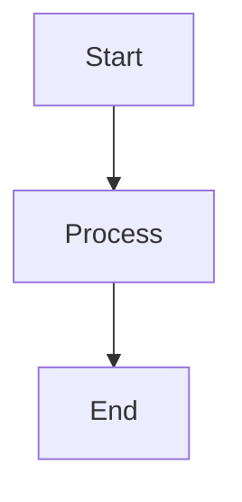

# Specification Template

## Overview

**Title**: [Brief, descriptive title]

**Type**: [Feature | Component | API | Type | Other]

**Status**: [Draft | Review | Approved | In Progress | Completed | Archived]

**Priority**: [High | Medium | Low]

**Estimated Effort**: [Small | Medium | Large | Extra Large]

**Date Created**: [YYYY-MM-DD]

**Last Updated**: [YYYY-MM-DD]

### Description
[Brief description of what this spec covers]

### Goals
- [Goal 1]
- [Goal 2]
- [Goal 3]

### Dependencies
- [List any prerequisites, related specs, or external dependencies]
- [Link to related issues or specs]

## Requirements

### Functional Requirements
- [FR-001] [Requirement description]
- [FR-002] [Requirement description]

### Non-Functional Requirements
- [NFR-001] [Performance, security, usability requirements]
- [NFR-002] [Accessibility, scalability requirements]

### User Stories
- As a [user type], I want [functionality] so that [benefit]
- As a [user type], I want [functionality] so that [benefit]

## Technical Specification

### API Interface
```typescript
// Define interfaces, types, and function signatures
interface ComponentProps {
  // props definition
}

type ComponentState = {
  // state definition
};
```

### Data Structures
```typescript
// Define data models and DTOs
interface DataModel {
  // model definition
}
```

### Component Structure
```typescript
// For React components
const ComponentName: React.FC<ComponentProps> = (props) => {
  // Component implementation outline
};
```

### State Management
[Describe how state will be managed - Context, Redux, local state, etc.]

### Error Handling
[Describe error handling approach and error types]

## Implementation Notes

### Architecture Decisions
- [Decision 1 and rationale]
- [Decision 2 and rationale]

### Design Patterns
- [Pattern 1 to be used]
- [Pattern 2 to be used]

### Code Organization
- [File structure and organization approach]
- [Import/export strategy]

### Testing Strategy
- [Unit tests]
- [Integration tests]
- [E2E tests]
- [Mocking strategy]

## Acceptance Criteria

### Functional Tests
- [ ] [Test scenario 1]
- [ ] [Test scenario 2]
- [ ] [Test scenario 3]

### Edge Cases
- [ ] [Edge case 1]
- [ ] [Edge case 2]

### Performance Criteria
- [ ] [Performance requirement 1]
- [ ] [Performance requirement 2]

### Security Requirements
- [ ] [Security requirement 1]
- [ ] [Security requirement 2]

## Diagrams



## References

- [Link to related issues]
- [Link to design documents]
- [Link to API documentation]
- [Link to similar implementations]

## Notes

[Any additional notes, questions, or considerations]

---

*Template Version: 1.0 | Last Updated: 2024-01-XX*